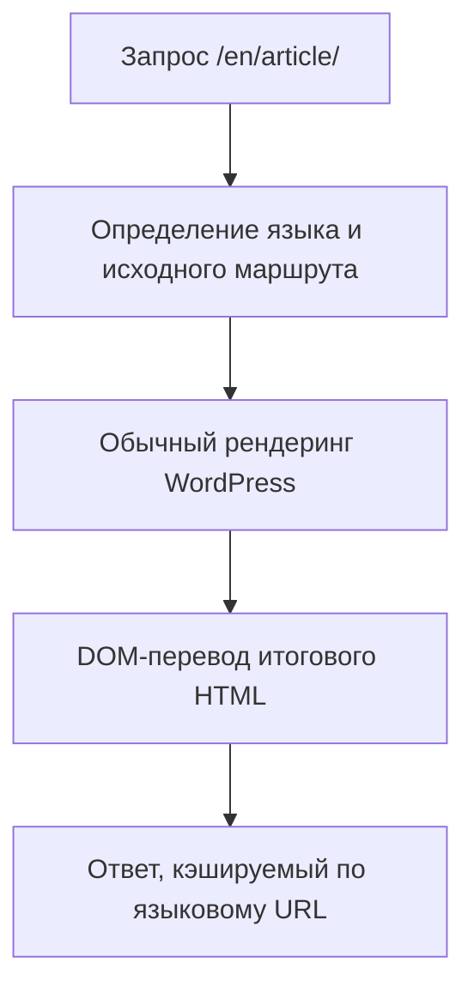

# Техническое устройство TranslatePress и ТЗ на аналогичный WordPress-плагин

Версия документа: 1.0  
Дата: 7 августа 2026  
Назначение: архитектурное описание для оценки и разработки WordPress-плагина мультиязычности без дублирования записей.

## 1. Краткий вывод

TranslatePress относится к классу плагинов, которые переводят **готовый результат рендеринга**, а не создают отдельную запись WordPress для каждого языка.

Исходная запись, страница, товар или шаблон остаются одними и теми же. На запросе языкового URL плагин:

1. определяет требуемый язык по URL;
2. позволяет WordPress, теме и другим плагинам сформировать обычную страницу на исходном языке;
3. перехватывает готовый HTML через PHP output buffering;
4. разбирает HTML в DOM;
5. извлекает текстовые узлы и переводимые атрибуты;
6. получает переводы из собственных таблиц БД;
7. при необходимости вызывает сервис машинного перевода и сохраняет результат;
8. заменяет строки, ссылки, изображения и метаданные;
9. отдаёт посетителю готовый HTML нужного языка.

Это даёт модель:

```text
1 запись WordPress
+ N языковых URL
+ N наборов строковых переводов в собственных таблицах
```

Официальное описание подтверждает, что TranslatePress работает с итоговым содержимым страницы, включая шорткоды, формы и конструкторы, а переводы хранит локально в базе данных: [страница плагина на WordPress.org](https://wordpress.org/plugins/translatepress-multilingual/).

## 2. Что является фактом о TranslatePress, а что — рекомендацией для нового плагина

В документе разделены два уровня:

- **Фактическая архитектура TranslatePress** — проверена по публичной документации и открытому GPL-ядру TranslatePress 3.3.1.
- **Рекомендуемая архитектура аналога** — проектное решение, которое повторяет пользовательскую модель, но не обязано копировать внутреннюю структуру TranslatePress.

Премиальный SEO Pack не входит в публичное бесплатное ядро. Поэтому его внешнее поведение и таблицы описаны по официальной документации, а предлагаемая реализация SEO-модуля является технической рекомендацией для нового плагина.

## 3. Главная архитектурная идея



Плагин не должен изменять `wp_posts.post_content` при показе переведённой страницы. Перевод применяется только к ответу текущего HTTP-запроса.

### Последствия модели

- Gutenberg, Elementor, Bricks, WPBakery, шорткоды, формы и WooCommerce сначала рендерят исходный HTML обычным способом.
- Плагин переводит то, что реально появилось на фронтенде, поэтому ему не требуется знать внутреннюю схему хранения каждого конструктора.
- Перевод привязан прежде всего к исходной строке, а не к отдельной копии `post_id`.
- Изменение исходной строки может сделать старый перевод неприменимым. TranslatePress считает изменённый текст новой строкой и использует translation memory только как подсказку: [описание редактора](https://translatepress.com/docs/translation-editor/).
- Динамический контент, появившийся после загрузки страницы, требует отдельного JavaScript-контура.

## 4. Фактические подсистемы TranslatePress

### 4.1. Bootstrap и реестр компонентов

Открытое ядро загружается рано на `plugins_loaded` и создаёт центральный объект-контейнер. Он инициализирует компоненты настроек, языков, URL-конвертера, рендерера, запросов к БД, gettext, машинного перевода, редактора и переключателя языков.

Для аналога рекомендуется не делать один перегруженный singleton. Лучше использовать небольшой dependency container и отдельные сервисы с интерфейсами.

### 4.2. Определение текущего языка

Основной вариант URL:

```text
https://example.com/article/       — язык по умолчанию
https://example.com/en/article/    — английский
https://example.com/de/article/    — немецкий
```

Компонент маршрутизации:

1. получает текущий абсолютный URL;
2. сравнивает первый сегмент пути со списком языковых slug;
3. устанавливает язык текущего запроса;
4. при необходимости делает канонический редирект;
5. изменяет `home_url()` и формируемые WordPress ссылки;
6. переписывает внутренние ссылки в итоговом DOM.

TranslatePress автоматически добавляет языковой префикс к внутренним ссылкам и учитывает переведённые slug: [официальное описание URL-конвертации](https://translatepress.com/docs/developers/translating-an-internal-url/).

### 4.3. Перехват готового HTML

На фронтенде TranslatePress запускает `ob_start()` на раннем `init`.

- На исходном языке буфер в основном очищает служебные маркеры и корректирует ссылки.
- На дополнительном языке callback получает весь HTML и запускает полный перевод.
- `wp-admin`, cron, XML-RPC, собственные AJAX-запросы и некоторые REST-сценарии обрабатываются отдельно или исключаются.
- `script` и `style` временно удаляются перед DOM-разбором, чтобы не переводить код и не тратить ресурсы парсера.
- JSON/AJAX-ответы проходят отдельную рекурсивную обработку только в поддерживаемых сценариях.

Это важное отличие от подхода через фильтры `the_content`: одного `the_content` недостаточно, потому что он не покрывает меню, header/footer, виджеты, формы, SEO-теги и HTML сторонних плагинов.

### 4.4. DOM-разбор и извлечение строк

Готовый HTML преобразуется в DOM-дерево. Из него извлекаются:

- текстовые узлы;
- содержимое `button` и `option`;
- `value` у submit/button/reset;
- `placeholder`;
- `title`;
- `aria-label`;
- отдельные `href`;
- `src`, `srcset`, `poster` и ссылки на медиа;
- SEO-метаданные, если зарегистрирован SEO-модуль;
- объединённые HTML-блоки перевода.

По умолчанию исключаются:

- `script`, `style`;
- служебные элементы админ-бара;
- числовые значения и проценты;
- элементы с `data-no-translation`;
- элементы/строки, исключённые настройками или фильтрами;
- кодоподобные фрагменты;
- URL, которые должны только локализоваться, но не отправляться в переводчик.

Для контента с контекстом редактор может объединить несколько узлов в translation block. Официальный редактор поддерживает перевод целого HTML-блока, но такие блоки не применяются к gettext и динамически вставленному JavaScript-контенту: [Translation Blocks](https://translatepress.com/docs/translation-editor/).

### 4.5. Поиск и подстановка переводов

После извлечения строк плагин:

1. удаляет дубликаты строк в рамках запроса;
2. одним или несколькими пакетными запросами получает существующие переводы;
3. сопоставляет перевод с каждым DOM-узлом;
4. безопасно заменяет текст или значение атрибута;
5. сериализует DOM обратно в HTML.

Статусы строк в открытом ядре TranslatePress 3.3.1:

| Код | Смысл |
|---:|---|
| `0` | перевода нет |
| `1` | машинный перевод |
| `2` | проверено/изменено человеком |
| `3` | перевод получен из почти идентичной строки |
| `4` | gettext-перевод найден в языковом файле |

Типы строковых блоков:

| Код | Смысл |
|---:|---|
| `0` | обычная строка |
| `1` | активный translation block |
| `2` | устаревший/разделённый translation block |

### 4.6. Ленивое обнаружение строк

По умолчанию TranslatePress обнаруживает и сохраняет новые строки при посещении переведённых страниц. Это подтверждено в [Advanced Settings](https://translatepress.com/docs/settings/advanced-settings/). Опция Manual Translation Only запрещает запись и машинный перевод вне редактора.

Это означает, что словарь формируется не только при сохранении записи WordPress, а во время фронтенд-запросов.

Плюс подхода: переводится любой реально отрендеренный контент.  
Минус: бот или первый посетитель может инициировать запись в БД и платный API-вызов.

### 4.7. Машинный перевод

Фактический поток:

1. из DOM выбираются отсутствующие строки;
2. URL, исключения, числа и неподходящие фрагменты отбрасываются;
3. строки дедуплицируются;
4. делятся на пакеты провайдера;
5. отправляются в API TranslatePress AI, Google или DeepL;
6. каждый успешно переведённый пакет немедленно сохраняется в БД;
7. при следующем запросе используется локальная копия.

Официальная документация прямо указывает, что каждая отсутствующая строка переводится автоматически один раз и затем сохраняется в БД: [Automatic Translation](https://translatepress.com/docs/automatic-translation/). Внешний API может вызываться фронтенд-посещением, а провайдеру передаётся текст страницы; это отражено в [описании внешних сервисов](https://wordpress.org/plugins/translatepress-multilingual/).

В текущем открытом ядре также есть:

- пакетная отправка;
- дедупликация одинаковых строк;
- лимит времени машинного перевода в рамках одного HTTP-запроса;
- сохранение каждого завершённого пакета, чтобы повторный запрос не оплачивал его заново;
- дневные лимиты;
- запрет запуска перевода поисковыми роботами;
- журнал запросов и ошибок.

### 4.8. Gettext темы и плагинов

Обычный DOM-перевод не хранит gettext-контекст, text domain и формы множественного числа. Поэтому TranslatePress имеет отдельный контур для строк, созданных через `__()`, `_e()`, `_x()`, `_n()` и связанные функции WordPress.

Контур gettext:

1. подключается к WordPress gettext-фильтрам;
2. знает исходную строку, `domain`, `context` и plural form;
3. ищет перевод в отдельном gettext-словаре;
4. в режиме редактора временно маркирует строку служебным HTML-тегом/атрибутом;
5. DOM-редактор связывает видимый элемент с ID gettext-строки;
6. в обычном режиме маркеры удаляются до отправки HTML;
7. отсутствующие gettext-строки могут переводиться машинно на `shutdown`.

Для нового плагина gettext нельзя сводить к обычной строке: одинаковый текст в разных доменах или контекстах может иметь разные переводы.

### 4.9. Динамически добавленный JavaScript-контент

PHP не видит строки, которые React/Vue/Elementor popup/AJAX вставили после отправки HTML. Поэтому фронтенд-скрипт TranslatePress:

1. запускает `MutationObserver`;
2. отслеживает добавленные узлы и изменённые поддерживаемые атрибуты;
3. исключает служебные селекторы;
4. собирает новые уникальные строки;
5. отправляет AJAX-запрос за переводами;
6. заменяет содержимое узлов в браузере;
7. предотвращает повторную обработку собственных изменений.

Для аналога обязательны защита от бесконечного цикла observer, пакетирование, debounce и отметка уже обработанных узлов через `WeakSet` или `data-*`.

### 4.10. Визуальный редактор

Редактор состоит из панели управления и preview сайта. В preview TranslatePress добавляет к узлам служебные идентификаторы переводов. При наведении пользователь выбирает элемент, панель загружает исходник и переводы, затем сохраняет изменения AJAX-запросом.

Нужны два режима:

- **Visual Editor** — перевод видимых узлов конкретной страницы;
- **String Translation** — поиск и массовая работа со строками, gettext и slug без необходимости открывать страницу.

Публичная документация описывает визуальное редактирование строк, поиск скрытых SEO-строк и live preview: [Translation Editor](https://translatepress.com/docs/translation-editor/).

## 5. Фактическая модель данных TranslatePress

TranslatePress хранит переводы направленно: от одного языка по умолчанию к каждому дополнительному языку. При смене исходного языка существующие связи могут потерять смысл.

Основные таблицы:

| Таблица | Назначение |
|---|---|
| `wp_trp_dictionary_{source}_{target}` | словарь обычных и блочных переводов для языковой пары |
| `wp_trp_original_strings` | уникализируемый реестр исходных строк |
| `wp_trp_original_meta` | контекст исходной строки, в том числе связь с родительским `post_id` |
| `wp_trp_gettext_{locale}` | переводы gettext для конкретной локали |
| `wp_trp_gettext_original_strings` | исходные gettext-строки, domain, context, plural |
| `wp_trp_gettext_original_meta` | метаданные gettext-строк |
| `wp_trp_slug_originals` | исходные slug |
| `wp_trp_slug_translations` | переводы slug |
| `wp_trp_machine_translation_log` | журнал машинного перевода |
| `wp_options` с префиксом `trp_` | языки, slug языков, режимы, API-настройки |

Список таблиц и направленное хранение официально описаны в инструкции по [миграции переводов](https://translatepress.com/docs/migrate-translations-across-sites/).

Упрощённая фактическая схема обычного словаря:

```text
id bigint PK
original longtext
translated longtext nullable
status int
block_type int
original_id bigint nullable
```

Имя таблицы содержит исходную и целевую локаль, например:

```text
wp_trp_dictionary_bg_bg_en_us
```

### Слабые места фактической схемы

- отдельная таблица на языковую пару усложняет аналитику, миграции и большое число языков;
- длинный `original` плохо подходит для строгого уникального индекса;
- одинаковая короткая строка без контекста может получить один перевод в разных местах;
- изменение исходной строки создаёт новую запись;
- посещения страниц раздувают таблицы неиспользуемыми строками;
- необходимы фоновые процедуры очистки дублей и устаревших данных.

## 6. Рекомендуемая модель данных нового плагина

Для нового продукта лучше сохранить пользовательскую модель TranslatePress, но использовать нормализованную схему.

### 6.1. `wp_mlp_sources`

| Поле | Тип | Назначение |
|---|---|---|
| `id` | bigint unsigned PK | ID исходной единицы |
| `source_locale` | varchar(20) | исходная локаль |
| `kind` | varchar(32) | text, attribute, html_block, gettext, seo, slug, media_url |
| `source_text` | longtext | исходное значение |
| `source_hash` | binary(32) | SHA-256 нормализованного значения |
| `context_hash` | binary(32) | контекст места использования |
| `domain` | varchar(191) nullable | gettext domain |
| `gettext_context` | varchar(191) nullable | `_x()` context |
| `plural_key` | tinyint nullable | форма множественного числа |
| `created_at` | datetime | дата создания |
| `last_seen_at` | datetime | последнее обнаружение |

Уникальный индекс:

```text
UNIQUE(source_locale, kind, source_hash, context_hash, domain, gettext_context, plural_key)
```

### 6.2. `wp_mlp_translations`

| Поле | Тип | Назначение |
|---|---|---|
| `id` | bigint unsigned PK | ID перевода |
| `source_id` | bigint unsigned | ссылка на исходник |
| `target_locale` | varchar(20) | целевая локаль |
| `translated_text` | longtext | перевод |
| `status` | varchar(20) | missing, machine, review, approved, stale, rejected |
| `provider` | varchar(50) nullable | google, deepl, openai, custom |
| `model` | varchar(100) nullable | использованная модель |
| `source_revision` | binary(32) | hash исходника при переводе |
| `created_by` | bigint unsigned nullable | пользователь |
| `created_at` | datetime | дата создания |
| `updated_at` | datetime | дата обновления |

Уникальный индекс:

```text
UNIQUE(source_id, target_locale)
```

### 6.3. `wp_mlp_occurrences`

Хранит места использования строк и нужен для редактора, очистки и отчёта о покрытии.

| Поле | Тип | Назначение |
|---|---|---|
| `id` | bigint unsigned PK | ID появления |
| `source_id` | bigint unsigned | исходная строка |
| `object_type` | varchar(32) | post, term, option, template, url |
| `object_id` | bigint unsigned nullable | `post_id`, `term_id` и т. п. |
| `url_hash` | binary(32) nullable | страница обнаружения |
| `selector_hint` | varchar(255) nullable | устойчивый CSS/DOM hint |
| `attribute_name` | varchar(64) nullable | placeholder, alt и т. п. |
| `first_seen_at` | datetime | первое обнаружение |
| `last_seen_at` | datetime | последнее обнаружение |

### 6.4. `wp_mlp_routes`

Отдельное хранилище локализованных slug и входящей маршрутизации.

| Поле | Тип | Назначение |
|---|---|---|
| `id` | bigint unsigned PK | ID маршрута |
| `object_type` | varchar(32) | post, term, post_type_base, taxonomy_base |
| `object_id` | bigint unsigned nullable | объект WordPress |
| `locale` | varchar(20) | язык |
| `source_slug` | varchar(200) | исходный slug |
| `translated_slug` | varchar(200) | локализованный slug |
| `path_hash` | binary(32) | уникальность полного пути |
| `status` | varchar(20) | active, old, conflict |

Нужно хранить старые маршруты для 301-редиректов после изменения переведённого slug.

### 6.5. Дополнительные таблицы

- `wp_mlp_jobs` — фоновые задания предварительного перевода;
- `wp_mlp_usage` — расход символов/слов и стоимость по дням и провайдерам;
- `wp_mlp_logs` — ошибки API, маршрутизации и рендеринга с ограниченным сроком хранения;
- `wp_mlp_glossary` — термины и фиксированные переводы;
- `wp_mlp_redirects` — старый путь → новый путь, если это не объединено с routes.

## 7. Требования к обработке HTTP-запроса

### 7.1. До выполнения основного WordPress Query

1. Разобрать URL без доверия к `$_SERVER` напрямую.
2. Определить locale по языковому сегменту или домену.
3. Проверить, опубликован ли язык.
4. Для переведённого slug найти исходный WordPress-объект.
5. Подменить request/query vars так, чтобы WordPress загрузил исходную запись.
6. Выполнить только один канонический 301-редирект при неправильном регистре, slash, языке или старом slug.
7. Не использовать cookie как основной сигнал языка для индексируемых страниц. Язык должен однозначно определяться URL.

### 7.2. После обычного рендеринга WordPress

1. Получить output buffer.
2. Проверить Content-Type; переводить только разрешённые HTML/JSON-сценарии.
3. Временно вынуть `script`, `style`, JSON-LD и другие защищённые блоки.
4. Построить DOM с отказоустойчивым HTML5-парсером.
5. Извлечь строки и атрибуты по registry правил.
6. Выполнить batch lookup переводов.
7. Если разрешено — поставить отсутствующие строки в очередь или перевести синхронно в пределах жёсткого time budget.
8. Заменить значения с экранированием по контексту.
9. Локализовать внутренние ссылки.
10. Добавить SEO-элементы.
11. Вернуть защищённые блоки.
12. Сериализовать и отдать результат.

## 8. SEO-модуль: обязательный объём

TranslatePress SEO Pack переводит slug, title, description, image alt, Open Graph и Twitter metadata и расширяет sitemap SEO-плагинов: [SEO Pack](https://translatepress.com/docs/addons/seo-pack/).

Аналог должен обеспечивать следующее.

### 8.1. Индексируемые языковые URL

Для каждой опубликованной языковой версии должен существовать отдельный стабильный URL с HTTP 200.

```text
/article/
/en/article/
/de/artikel/
```

Нельзя отдавать один URL на разных языках только по cookie или `Accept-Language`.

### 8.2. Canonical

- canonical каждой языковой страницы указывает на неё саму;
- не ставить canonical всех переводов на исходную страницу;
- учитывать translated slug, пагинацию, trailing slash и HTTPS;
- интегрироваться с Rank Math, Yoast, SEOPress и core canonical через их фильтры;
- удалять дублирующий canonical, если его уже вывел другой модуль.

### 8.3. Hreflang

На каждой индексируемой версии вывести полный взаимный набор:

```html
<link rel="alternate" hreflang="bg" href="https://example.com/article/">
<link rel="alternate" hreflang="en" href="https://example.com/en/article/">
<link rel="alternate" hreflang="de" href="https://example.com/de/artikel/">
<link rel="alternate" hreflang="x-default" href="https://example.com/article/">
```

Набор должен быть одинаковым и взаимным на всех версиях. Не публиковать hreflang для чернового или запрещённого языка.

### 8.4. Перевод SEO-полей

Поддержать минимум:

- `<title>`;
- meta description;
- robots, если политика отличается по языку;
- Open Graph title/description/url/image/locale;
- Twitter title/description/image;
- image `alt` и при необходимости media replacement;
- schema JSON-LD: только разрешённые текстовые поля и URL, без слепого перевода ключей и идентификаторов;
- breadcrumb labels и URLs;
- archive, taxonomy, author и search titles.

### 8.5. Sitemap

Два допустимых варианта:

- добавить языковые URL как отдельные `<url>`;
- использовать `<xhtml:link rel="alternate" hreflang="…">` для каждой записи и при необходимости также отдельные URL.

Обязательны адаптеры для:

- WordPress core sitemap;
- Rank Math;
- Yoast SEO;
- SEOPress.

Каждый URL в sitemap должен возвращать 200, иметь self-canonical и не быть `noindex`.

### 8.6. Перевод slug

> **СТАТУС: НЕОБЯЗАТЕЛЬНО.** Решением владельца проекта (8 августа 2026) перевод slug выведен из обязательного объёма и отложен на неопределённый срок. Языковые адреса остаются в виде `/en/<исходный-slug>/`. Раздел сохранён как проектная заготовка на случай, если функцию решат делать позже.
>
> Причина: самая рискованная часть — обратное разрешение переведённого URL в исходный объект WordPress. Ошибка в ней даёт 404 на живых страницах, а выигрыш для SEO по сравнению с уже реализованными hreflang/canonical невелик.

Нужно поддержать:

- post/page/custom post type slug;
- parent path и иерархические страницы;
- taxonomy base;
- term slug;
- post type base;
- WooCommerce product/category/tag bases;
- конфликт slug внутри одной локали;
- 301 после изменения перевода;
- обратное разрешение переведённого URL в исходный объект WordPress.

TranslatePress хранит исходные и переведённые slug отдельно и позволяет ручной и автоматический перевод: [URL Slug Translation](https://translatepress.com/docs/translation-editor/url-slug-translation/).

## 9. Машинный перевод: рекомендуемая реализация

### 9.1. Интерфейс провайдера

```php
interface TranslationProviderInterface {
    public function supports(string $sourceLocale, string $targetLocale): bool;

    /** @return array<string,string> sourceHash => translatedText */
    public function translateBatch(
        array $items,
        string $sourceLocale,
        string $targetLocale,
        TranslationContext $context
    ): array;
}
```

Провайдеры: Google Cloud Translation, DeepL, OpenAI/LLM, кастомный REST endpoint.

### 9.2. Режимы запуска

| Режим | Поведение |
|---|---|
| Manual only | обнаружение и API-вызовы только в редакторе |
| Lazy | перевод отсутствующих строк при первом открытии языка |
| Queue | фронтенд показывает fallback, перевод выполняется WP-Cron/Action Scheduler |
| Pretranslate | администратор запускает обход выбранных URL до публикации языка |

Рекомендуемый production-вариант: **Queue + Pretranslate**. Синхронный Lazy оставить опцией, потому что он ухудшает TTFB и позволяет посетителю инициировать расходы.

### 9.3. Обязательные ограничения

- лимит символов/слов в день;
- лимит стоимости;
- лимит одного задания;
- retry с exponential backoff;
- idempotency key на пакет;
- дедупликация по source hash;
- не отправлять секретные, персональные и административные страницы;
- не запускать API для известных crawler user-agent;
- сохранять каждый успешный пакет транзакционно;
- не перезаписывать `approved` перевод машинным;
- помечать перевод `stale`, если изменился исходник;
- вести журнал без хранения API-ключей и лишних персональных данных.

## 10. Визуальный редактор: требования

### 10.1. Интерфейс

- левая панель с исходником и полями всех целевых языков;
- iframe/preview текущей страницы;
- hover-outline и кнопка выбора элемента;
- фильтр по типу: regular, gettext, SEO, slug, image, link;
- статусы missing/machine/review/approved/stale;
- поиск по исходнику и переводу;
- переход по страницам без выхода из редактора;
- режим logged-in/logged-out;
- translation memory и glossary suggestions.

### 10.2. Идентификация DOM-узла

В editor preview сервер должен добавить:

```html
<span data-mlp-source-id="123" data-mlp-kind="text">Исходный текст</span>
```

Для атрибутов:

```html
<input
  placeholder="Исходный текст"
  data-mlp-source-id-placeholder="456"
>
```

На обычном фронтенде эти маркеры не должны присутствовать.

### 10.3. API редактора

Минимальные endpoints:

```text
GET    /wp-json/mlp/v1/sources/{id}
PUT    /wp-json/mlp/v1/translations/{source_id}/{locale}
POST   /wp-json/mlp/v1/blocks
DELETE /wp-json/mlp/v1/blocks/{id}
GET    /wp-json/mlp/v1/search
POST   /wp-json/mlp/v1/pretranslate
GET    /wp-json/mlp/v1/jobs/{id}
```

Все изменяющие операции: capability check, REST nonce, валидация locale, whitelist статуса и контекстная очистка HTML.

## 11. WordPress hooks и точки интеграции

Рекомендуемый минимальный набор:

| Hook/API | Назначение |
|---|---|
| `plugins_loaded` | bootstrap и DI |
| `init` | язык, output buffer, rewrite setup |
| `parse_request` / `request` | обратное разрешение переведённых slug |
| `template_redirect` | канонические редиректы |
| `locale`, `plugin_locale` | локаль WordPress/gettext |
| `gettext`, `gettext_with_context`, `ngettext` | перевод строк темы/плагинов |
| `home_url`, `post_link`, `page_link`, `term_link` | языковые URL |
| `language_attributes` | `lang` и `dir` |
| `wp_head` или SEO-фильтры | hreflang/canonical/meta |
| `wp_sitemaps_*` | core sitemap |
| `wp_mail` | язык транзакционных писем |
| `rest_pre_echo_response` | разрешённые REST-сценарии |
| `shutdown` | завершение логов/очередей, но не тяжёлый перевод |

Необходимо предусмотреть адаптеры, а не жёстко связывать ядро с Rank Math, Yoast или WooCommerce.

## 12. Кэширование и производительность

### 12.1. Правила кэша

- page cache должен различать языковые URL;
- при URL-модели язык уже является частью cache key;
- Object Cache ключ: `locale + source_hash + context_hash`;
- пакетно получать все переводы страницы через `IN` по hash/ID;
- не выполнять один SQL-запрос на каждый DOM-узел;
- кэшировать route map и language settings;
- сбрасывать страницу/объектный кэш после ручного изменения перевода;
- при сохранении slug сбрасывать rewrite/routes и sitemap cache;
- не кэшировать editor preview как публичную страницу.

### 12.2. Целевые показатели

- при полностью прогретом словаре: не более 3–5 дополнительных SQL-запросов на страницу;
- отсутствие внешних API-вызовов в обычном прогретом запросе;
- DOM-перевод страницы 200 KB: ориентир до 50 ms на современном PHP 8.2+, исключая WordPress и кэш;
- пиковая дополнительная память не более 3–5 размеров HTML-ответа;
- динамический JS endpoint: p95 до 300 ms без машинного API;
- отсутствие заметного изменения CLS.

DOM-парсинг всего ответа является самой дорогой частью архитектуры. Для высоконагруженных сайтов необходим полный page cache после перевода.

## 13. Безопасность

Обязательные меры:

- `current_user_can()` на всех операциях редактора;
- nonce на AJAX/REST write-запросах;
- `$wpdb->prepare()` и allowlist имён таблиц/locale;
- строгая нормализация языкового кода;
- экранирование по месту подстановки: text, attribute, URL, HTML block, JSON-LD;
- HTML-блоки очищать через отдельный allowlist `wp_kses`;
- запрещать перевод `script`, inline event handlers, nonce, CSRF tokens, hidden security fields;
- SSRF-защита для кастомного translation endpoint;
- API-ключи не выводить в HTML, JS, логи и REST;
- rate limit для публичного динамического endpoint;
- не разрешать анонимному запросу без ограничений запускать платный перевод;
- журналировать изменение перевода: пользователь, время, старое и новое значение;
- безопасное удаление данных только после явного подтверждения и резервной копии.

Если разработка использует код TranslatePress, необходимо учитывать GPLv2 и условия распространения производного продукта. Если нужен закрытый коммерческий плагин, следует делать clean-room реализацию по функциональному ТЗ и получить отдельную юридическую оценку лицензирования.

## 14. Совместимость

Первая поддерживаемая матрица:

- WordPress: две последние major/minor линии;
- PHP: 8.1–8.4;
- MySQL 8 / MariaDB 10.6+;
- Gutenberg;
- Elementor;
- Bricks;
- WooCommerce, включая HPOS;
- Rank Math;
- Yoast SEO;
- WP Rocket/LiteSpeed Cache;
- Cloudflare/CDN;
- WordPress multisite — либо полноценная поддержка, либо явный запрет в MVP.

Для page builders тестируется именно финальный HTML, AJAX-фрагменты, popup/modal и формы. Для WooCommerce отдельно проверяются cart fragments, checkout, вариации, account pages, письма и REST Store API.

## 15. Этапы разработки

### Этап 1. Core MVP

- настройки исходного и одного целевого языка;
- URL-префикс;
- output buffering;
- DOM-извлечение текста и базовых атрибутов;
- нормализованные таблицы source/translation/occurrence;
- ручное редактирование через String Translation;
- language switcher;
- `html lang`, базовый hreflang;
- импорт/экспорт и полное удаление данных.

### Этап 2. Visual Editor

- preview iframe;
- DOM markers;
- выбор текста/атрибута;
- AJAX/REST save;
- статусы и revision history;
- translation blocks;
- media/link replacement.

### Этап 3. Automatic Translation

- provider interface;
- Google/DeepL/LLM adapter;
- очередь;
- квоты и стоимость;
- glossary;
- translation memory;
- pretranslate crawler по sitemap.

### Этап 4. Полное SEO

- ~~translated slugs и обратная маршрутизация~~ — **необязательно**, отложено (см. 8.6);
- canonical/hreflang/x-default;
- Rank Math/Yoast adapters;
- SEO meta, OG/Twitter, JSON-LD;
- multilingual sitemap;
- 301 history.

### Этап 5. Dynamic и WooCommerce

- MutationObserver;
- публичный read endpoint с rate limit;
- AJAX/REST translation;
- gettext/plurals/context;
- WooCommerce routes, fragments, checkout и emails.

### Этап 6. Hardening

- профилирование больших страниц;
- очистка orphan/stale rows;
- фоновые миграции схемы;
- security review;
- нагрузочное тестирование;
- compatibility suite.

## 16. Критерии приёмки

Плагин считается функционально готовым, если выполняются все условия:

1. Для перевода статьи не создаётся дополнительный `wp_posts` ID.
2. Исходная запись редактируется стандартным WordPress-редактором.
3. `/en/.../` возвращает серверный HTML на английском без обязательного клиентского перевода.
4. При отключённом JavaScript основной текст и SEO остаются переведёнными.
5. Переводы переживают обновление темы, плагинов и очистку page cache.
6. Одинаковая строка может иметь разные переводы в разных явно заданных контекстах.
7. Изменённый исходник помечает зависимый перевод как stale, а не молча показывает неверный текст.
8. Машинный перевод одной строки не оплачивается повторно после успешного сохранения.
9. Робот не может инициировать неограниченные платные API-вызовы.
10. Все языковые URL имеют self-canonical и взаимный hreflang.
11. Sitemap содержит только опубликованные индексируемые языковые URL.
12. ~~Старый переведённый slug отдаёт один 301 на новый URL.~~ — критерий снят вместе с переводом slug (см. 8.6), проверять нечего.
13. Rank Math и Yoast не создают дубли canonical/meta/hreflang.
14. Page cache не смешивает языки.
15. Editor endpoints недоступны пользователю без capability и nonce.
16. Удаление плагина без опции «удалить данные» не удаляет переводы.
17. Экспорт и повторный импорт восстанавливают переводы, slug, статусы и связи.

## 17. Основные риски проекта

| Риск | Последствие | Мера |
|---|---|---|
| Некорректный HTML ломает DOM parser | повреждение разметки | tolerant parser, fallback к исходному ответу, лог |
| Одинаковые строки без контекста | неверный перевод | `context_hash`, translation blocks, gettext context |
| Первый посетитель вызывает API | высокий TTFB и расходы | queue/pretranslate, budget, crawler block |
| Переведённый slug конфликтует | 404/неверная запись | уникальный path index, conflict UI |
| JS observer зацикливается | CPU/DOM loop | WeakSet, pause observer, debounce |
| Page cache смешивает языки | неправильный контент/SEO | язык только в URL, cache integration |
| SEO-плагин выводит вторые теги | дубли canonical/hreflang | adapter registry и deduplication |
| БД разрастается | медленные запросы | occurrences TTL, orphan cleanup, индексы, отчёт |
| Перевод HTML внедряет XSS | компрометация сайта | context-aware sanitization, restricted HTML |
| Миграция меняет URL | потеря SEO | export/import route map, 301 verification |

## 18. Рекомендация разработчику

Не следует начинать с визуального редактора. Самый безопасный порядок:

1. язык и маршрутизация;
2. стабильная модель данных;
3. server-side DOM translation;
4. SEO URL/canonical/hreflang;
5. обычный String Translation admin UI;
6. машинный перевод и очередь;
7. визуальный редактор;
8. JS dynamic translation;
9. интеграции.

Главная ценность продукта — не сам вызов переводчика, а корректная связка **маршрут → исходный WordPress-объект → извлечение строк → локальный словарь → серверный HTML → SEO**.

## 19. Источники

- [TranslatePress на WordPress.org: модель, GPL, локальное хранение, динамические строки и внешние сервисы](https://wordpress.org/plugins/translatepress-multilingual/)
- [Официальная документация: Translation Editor](https://translatepress.com/docs/translation-editor/)
- [Официальная документация: Automatic Translation](https://translatepress.com/docs/automatic-translation/)
- [Официальная документация: Advanced Settings и Manual Translation Only](https://translatepress.com/docs/settings/advanced-settings/)
- [Официальная документация: SEO Pack](https://translatepress.com/docs/addons/seo-pack/)
- [Официальная документация: URL Slug Translation](https://translatepress.com/docs/translation-editor/url-slug-translation/)
- [Официальная документация: внутренние языковые URL](https://translatepress.com/docs/developers/translating-an-internal-url/)
- [Официальная документация: таблицы и миграция переводов](https://translatepress.com/docs/migrate-translations-across-sites/)

